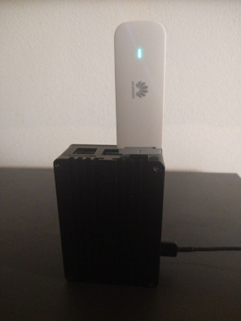

# rpi-zerotier-asterisk-lte

A simple guide to turning your Raspberry Pi into a **portable PBX** with **4G LTE connectivity** and a secure private network using **ZeroTier**.  
This setup is great for small offices, home labs, or mobile deployments.

---

## Features
- 4G LTE connectivity
- secure private network (ZeroTier)
- internal extensions
- incoming and outgoing calls via VoIP operator



---

## What You Will Need

- Raspberry Pi 3 or 4 (tested with RPi4, 4GB RAM recommended)  
- power supply for Raspberry Pi  
- USB LTE modem (tested: **Huawei E3372**)  
- microSD card (16GB or larger)  
- SIM card with a data plan  
- internet access (Wi-Fi or Ethernet, at least for initial setup)

---

## Preparing the SD Card

### 1. Download image and flash SD card
```sh
wget https://downloads.raspberrypi.com/raspios_arm64/images/raspios_arm64-2023-05-03/2023-05-03-raspios-bullseye-arm64.img.xz
xz -d -T0 2023-05-03-raspios-bullseye-arm64.img.xz
sudo dd bs=4M if=2023-05-03-raspios-bullseye-arm64.img of=/dev/mmcblk0 status=progress conv=fsync
```

### 2. Enable SSH and set password
- Generate password hash:
```sh
echo 'mypassword' | openssl passwd -6 -stdin
```
- Create an empty file `ssh`  
- Create a file `userconf` with the following content:
  ```
  pi:PASSWORDHASH
  ```
- Mount the SD card and copy both files into the **/boot** partition

---

## System Installation

### Update and upgrade system
```sh
sudo apt update && sudo apt upgrade -y
sudo reboot
```

### Install prerequisites
```sh
sudo apt install fail2ban iptables-persistent tcpdump -y
```

### Configure fail2ban
```sh
sudo cp /etc/fail2ban/jail.conf /etc/fail2ban/jail.local
sudo systemctl restart fail2ban
systemctl status fail2ban
sudo fail2ban-client status asterisk
```

### Configure timezone
```sh
sudo dpkg-reconfigure tzdata
```

## Configure Firewall (iptables)
Allow only LAN + operator IPs:
```bash
# allow localhost
sudo iptables -A INPUT -i lo -j ACCEPT
sudo iptables -A INPUT -m conntrack --ctstate RELATED,ESTABLISHED -j ACCEPT

# allow SSH
sudo iptables -A INPUT -p tcp --dport 22 -j ACCEPT

# allow SIP from operator + LAN
sudo iptables -A INPUT -p udp -s OPERATOR_IP --dport 5060 -j ACCEPT
sudo iptables -A INPUT -p udp -s 192.168.0.0/24 --dport 5060 -j ACCEPT

# allow RTP (media) ports
sudo iptables -A INPUT -p udp -s 192.168.0.0/24 --dport 10000:20000 -j ACCEPT
sudo iptables -A INPUT -p udp -s OPERATOR_IP --dport 10000:20000 -j ACCEPT

# drop all other SIP/RTP
sudo iptables -A INPUT -p udp --dport 5060 -j DROP
sudo iptables -A INPUT -p udp --dport 10000:20000 -j DROP

# install iptables-persistent to save rules
sudo apt install -y iptables-persistent
sudo iptables-save > /etc/iptables/rules.v4
```
---

## Install Asterisk

Asterisk is an open-source PBX that provides VoIP functionality.  
Install with:
```sh
sudo apt install asterisk asterisk-dahdi -y
```

## Configure Asterisk

[asterisk-pbx-howto](https://github.com/lanarka/asterisk-pbx-howto)

---

## Install and Configure ZeroTier

ZeroTier allows you to create an encrypted virtual network between devices.

### Installation
```sh
curl -s https://install.zerotier.com | sudo bash
```

### Join a network
```sh
sudo zerotier-cli join NETWORK-ID
```

Then:  
- authorize your Raspberry Pi in **ZeroTier Central** (web console)  
- check service status:
```sh
sudo service zerotier-one status
```
- test connectivity by pinging another device in the network

---

## 📶 Connect 4G LTE Modem

- No additional drivers required for **Huawei E3372**  
- Check if modem appears as **eth1** (DHCP)  
- Test internet connectivity:
```sh
ping 8.8.8.8
```
- Reboot device:
```sh
sudo reboot
```

---

Done! You now have a **mobile Asterisk PBX server** with LTE connectivity, securely accessible over ZeroTier.

